# 🏋️‍♂️ SweatLog

**SweatLog** is a minimal and effective web application to track your 30-day workout journey. Log daily workouts, stay motivated and build consistent fitness habits.

🔗 [Live Demo](https://sweat-log.vercel.app/)

---

## 📸 Screenshots

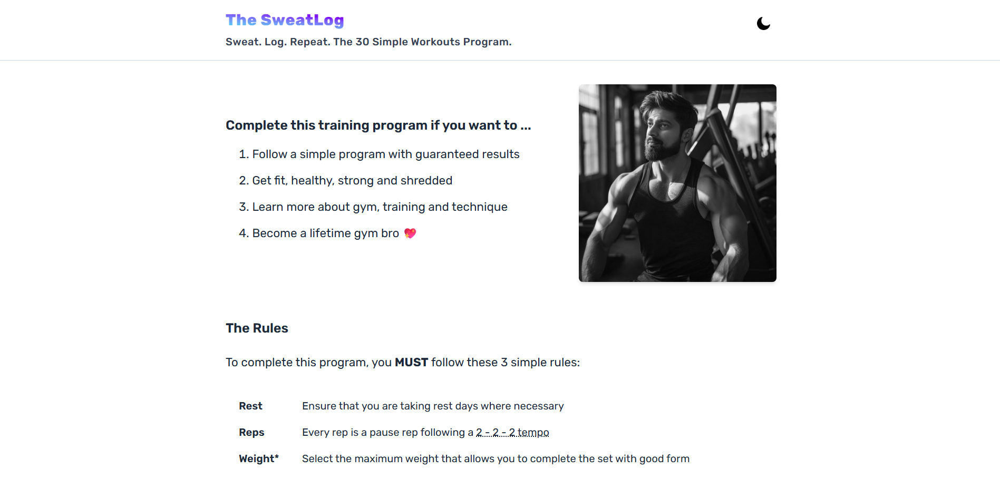  
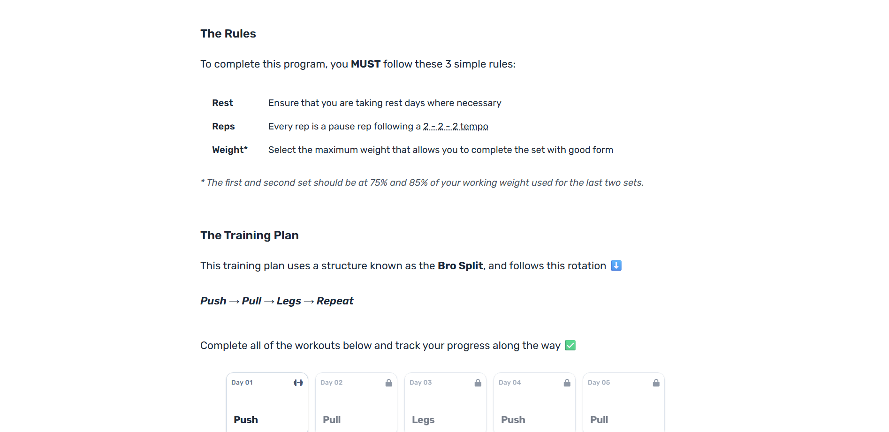  
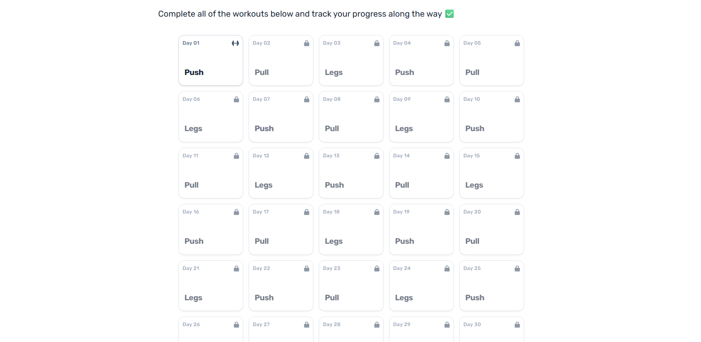
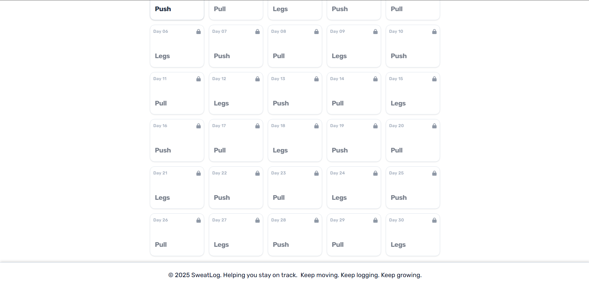
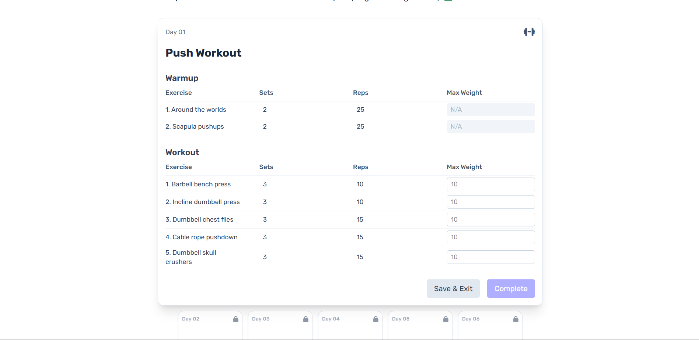
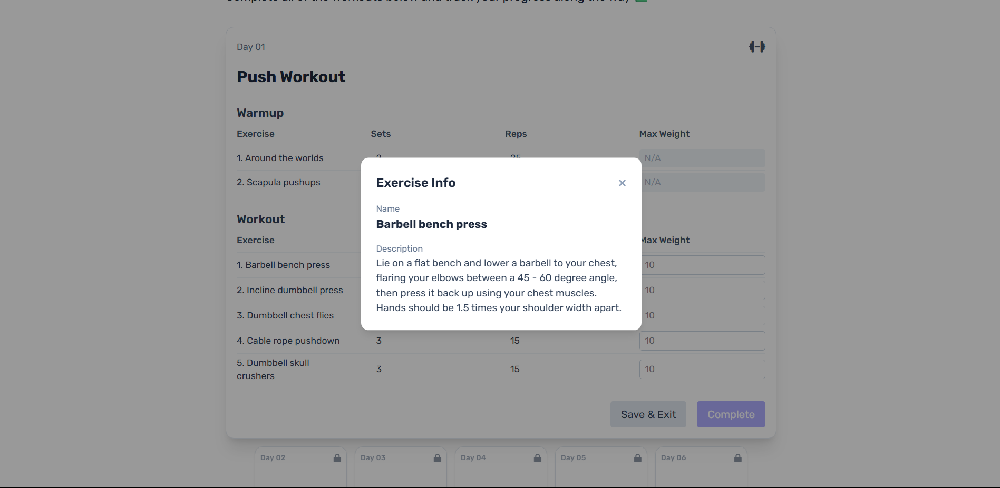
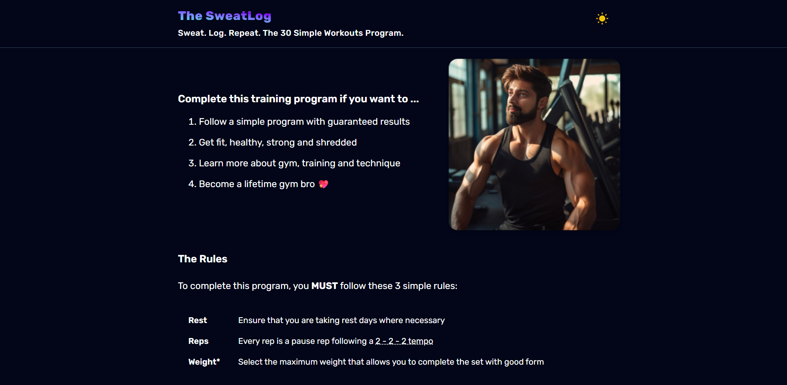
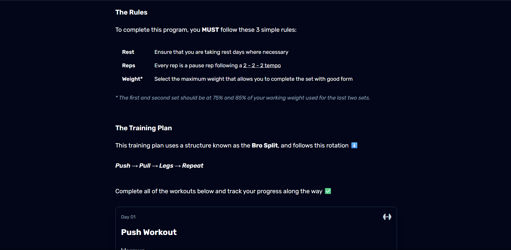
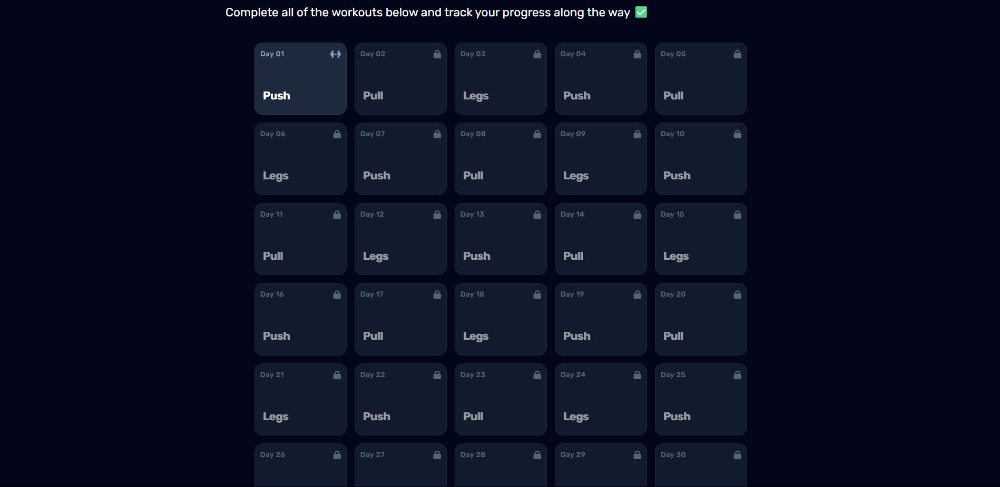
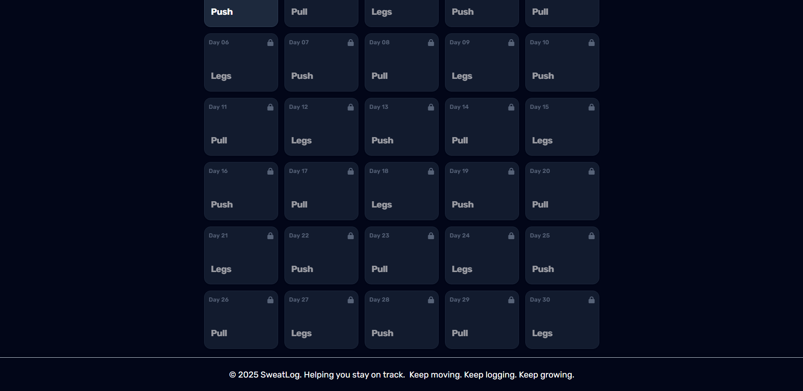
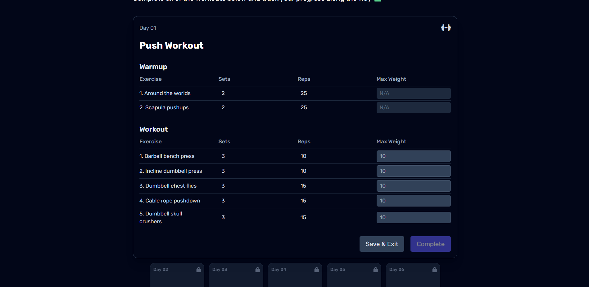
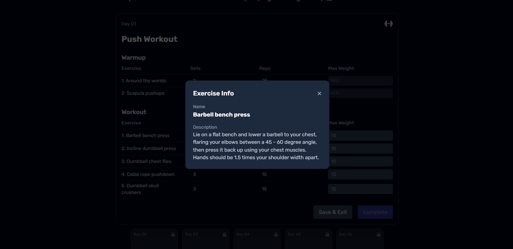

---

## 🚀 Tech Stack

- ⚛️ **React** – Frontend library  
- 🎨 **Tailwind CSS** – Utility-first styling  

---

## ✨ Features

- ✅ Log each day's workout with one click  
- 📅 Visual 30-day progress tracker  
- 🌗 Supports dark & light mode  
- 💾 Saves progress using local storage  
- 📱 Mobile-friendly and clean UI  

---

## ⚙️ Getting Started

1. 📂 Clone the repo  
2. 📦 Run `npm install`  
3. ▶️ Start with `npm run dev`  
4. 🛠️ Explore and modify the code

---

> _"Don’t stop when you’re tired. Stop when you’re done."_  
> — **David Goggins**

---

💻 Developed with determination, one rep at a time 💪🔥
